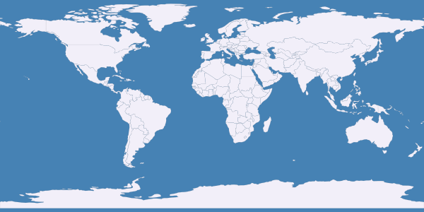

# Getting started with Python bindings

## Overview

This tutorial will ensure that Mapnik and its Python bindings are properly installed and introduce you to some of the basic programming concepts for Mapnik.

## Step 1: check installation

Make sure you have mapnik installed. You should be able to open a terminal and type:

```sh
mapnik-config -v # should return a version number.
```

Next test the Python bindings. You should be able to open a terminal and type:

```sh
python -c "import mapnik;print mapnik.__file__" # should return the path to the python bindings and no errors
```

If the above does not work (e.g. throws an `ImportError`) then please go back and ensure [Mapnik](https://github.com/mapnik/mapnik/wiki/Mapnik-Installation) and the [Mapnik Python bindings](/README.md) are properly installed.
## Step 2

Now, we need some data to render. Let's use a shapefile of world border polygons from [naturalearthdata.com](http://naturalearthdata.com) ([direct link](http://www.naturalearthdata.com/http//www.naturalearthdata.com/download/110m/cultural/ne_110m_admin_0_countries.zip)). Unzip the archive in an easily accessible location of your choosing. In *Step 3* we will be referencing the path to this shapefile in Python code, so make sure you know where you put it.

Once unzipped, you should see four files like:

```sh
ne_110m_admin_0_countries.shp
ne_110m_admin_0_countries.shx
ne_110m_admin_0_countries.dbf
ne_110m_admin_0_countries.prj
```

To download and unzip on the command line with the do:

```sh
wget http://www.naturalearthdata.com/http//www.naturalearthdata.com/download/110m/cultural/ne_110m_admin_0_countries.zip
unzip ne_110m_admin_0_countries.zip
```

## Step 3

Now we're going to program in Python and Mapnik, using sample code and the Python interpreter.

The idea here is not that you have to interact with Mapnik via Python, but that this is a good way to build foundational skills for how Mapnik works.

So, let's begin! Open a Python interpreter simply by typing in your terminal:

```sh
python
```

The code below can be pasted into your interpreter. Ideally paste line by line so you can confirm each step is working. The commented lines (#) should be able to be pasted without trouble, but depending on your interpreter setting may cause errors.

### Import Mapnik

Import the Mapnik Python bindings:

```python
import mapnik
```

### Create a Map

```python
m = mapnik.Map(600,300) # create a map with a given width and height in pixels
# note: m.srs will default to '+proj=longlat +ellps=WGS84 +datum=WGS84 +no_defs'
# the 'map.srs' is the target projection of the map and can be whatever you wish
m.background = mapnik.Color('steelblue') # set background colour to 'steelblue'.
```

### Create a Style

Create the Styles which determines how the data is rendered:

```python
s = mapnik.Style() # style object to hold rules
r = mapnik.Rule() # rule object to hold symbolizers
# to fill a polygon we create a PolygonSymbolizer
polygon_symbolizer = mapnik.PolygonSymbolizer()
polygon_symbolizer.fill = mapnik.Color('#f2eff9')
r.symbols.append(polygon_symbolizer) # add the symbolizer to the rule object

# to add outlines to a polygon we create a LineSymbolizer
line_symbolizer = mapnik.LineSymbolizer()
line_symbolizer.stroke = mapnik.Color('rgb(50%,50%,50%)')
line_symbolizer.stroke_width = 0.1
r.symbols.append(line_symbolizer) # add the symbolizer to the rule object
s.rules.append(r) # now add the rule to the style and we're done
```

And add the Style to the Map:

```python
m.append_style('My Style',s) # Styles are given names only as they are applied to the map
```

### Create a Datasource

In *Step 2* above you should have downloaded a sample shapefile of polygons of world countries. We are now going to load that into a `mapnik.Datasource` object in Python.

If your Python interpreter was launched from the same directory as you downloaded the natural earth shapefile to you should be able to use a relative path to create the datasource like:

``` python
ds = mapnik.Shapefile(file='ne_110m_admin_0_countries.shp')
```

Otherwise use an absolute path (exchanging `/Users/dane/Downloads/` for the correct path on your machine):

``` python
ds = mapnik.Shapefile(file='/Users/dane/Downloads/ne_110m_admin_0_countries.shp')
```

Note: optionally (to learn about your data) you can call the `envelope()` function off the datasource object to see the full coordinate bounds of the data:

``` python
>>> ds.envelope()
Box2d(-180.0,-90.0,180.0,83.64513)
```

That shows the minx, miny, maxx, and maxy of the data. Because the above coordinates are between -180 and 180 for the x or longitude values and -90 and 90 for the y or latitude values we know this data is in *geographic* coordinates and uses degrees for units - a pretty good indication this is `WGS84 (aka EPSG:4326)`. This specific shapefile also stores this projection information as a `WKT` string in the `ne_110m_admin_0_countries.prj` file. See the `layer.srs` value below for why this matters.


### Create a Layer

Mapnik Layers are basically containers around datasources, that store useful properties. Lets now create a Layer object and add the datasource to it.

``` python
layer = mapnik.Layer('world') # new layer called 'world' (we could name it anything)
# note: layer.srs will default to '+proj=longlat +ellps=WGS84 +datum=WGS84 +no_defs'
```

Note: the 'layer.srs' is the source projection of the Datasource and *must* match the projection of the coordinates of that data or else your map will likely be blank. Mapnik uses [Proj.4](http://trac.osgeo.org/proj/wiki/FAQ) strings to specify the spatial references system. In this case, the default `srs` Mapnik assumes (`+proj=longlat +ellps=WGS84 +datum=WGS84 +no_defs`) happens to match the projection of the data. When this is not the case you must set the layer.srs to the correct value (which is beyond the scope of this tutorial).

Now attach the datasource to the layer, and reference:

```python
layer.datasource = ds
```

Lastly, we need to make sure the style we created above (and attached to the map) is also applied to the layer, by its string reference:

```python
layer.styles.append('My Style')
```

### Prepare the Map for rendering

This step is critical. Finally add the layer to the map and zoom to the full extent of the data layer (using `zoom_all` which will calculate the cumulative extent of all layers attached to the map). If you do not zoom the Map to the extent of the layer(s), then the rendered output will be blank.

```python
m.layers.append(layer)
m.zoom_all()
```

### Render your map

Finish up by rendering your map image:

```python
# Write the data to a png image called world.png in the current directory
mapnik.render_to_file(m,'world.png', 'png')

# Exit the Python interpreter
exit() # or ctrl-d
```

Then back in your normal shell type:

```sh
# On a mac
open world.png
# On windows
start world.png
```

Or navigate to your base directory and open `world.png` and the result should look like this:



### Step 4

The next logical step is to run that same code all at once as a Python script from your shell/terminal (rather than pasted into the Python interpreter line-by-line). This way you will be able to modify and experiment with the settings, then simply re-run the script.

So, create a blank text file called `world.py`.

Make it executable:

    chmod +x world.py

Then add a line at the top of the script like:

```sh
#!/usr/bin/env python
```

Finally, append the entire text below and save the file.

```python
import mapnik
m = mapnik.Map(600,300)
m.background = mapnik.Color('steelblue')
s = mapnik.Style()
r = mapnik.Rule()
polygon_symbolizer = mapnik.PolygonSymbolizer()
polygon_symbolizer.fill = mapnik.Color('#f2eff9')
r.symbols.append(polygon_symbolizer)

line_symbolizer = mapnik.LineSymbolizer()
line_symbolizer.stroke = mapnik.Color('rgb(50%,50%,50%)')
line_symbolizer.stroke_width = 0.1

r.symbols.append(line_symbolizer)
s.rules.append(r)
m.append_style('My Style',s)
ds = mapnik.Shapefile(file='ne_110m_admin_0_countries.shp')
layer = mapnik.Layer('world')
layer.datasource = ds
layer.styles.append('My Style')
m.layers.append(layer)
m.zoom_all()
mapnik.render_to_file(m,'world.png', 'png')
print "rendered image to 'world.png'"
```

 * Don't forget to ensure the correct path to your `ne_110m_admin_0_countries.shp` shapefile.
 * Mapnik accepts both the absolute path to your data as well as the relative path (Same goes for the path to where you want to save your file)

Finally run the script with the command:


```sh
./world.py # You must be in the same directory as you saved the script
```

 * Note: if you re-run this script it will will re-write over the world.png map.
 * Now you can easily open the script in a separate text editor and try changing the dimensions, colors, or datasource (remember to use the correct `srs` if you change the datasource).
